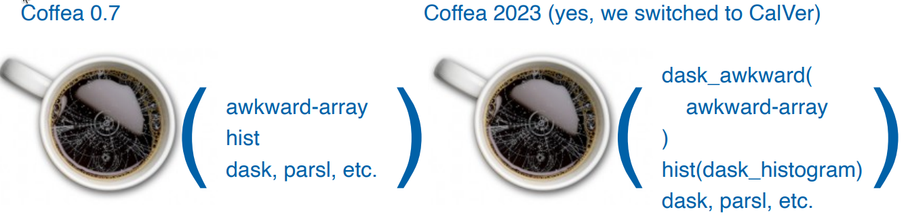
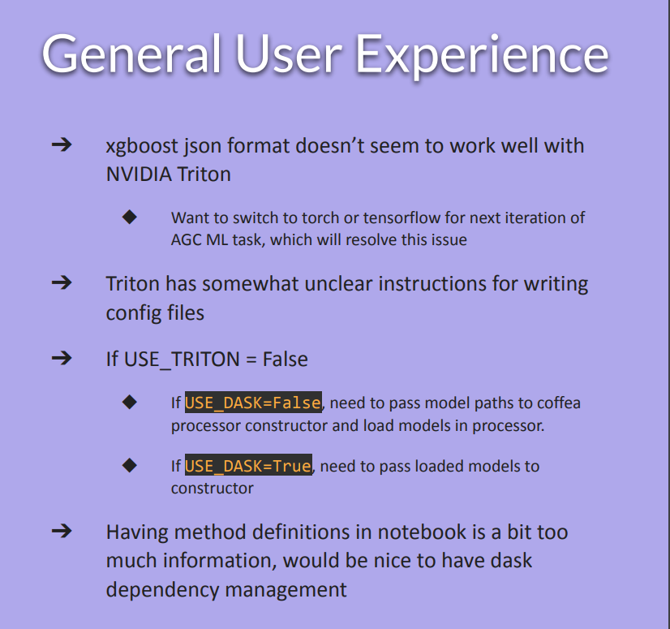

class: middle, center, title-slide
count: false

# Analysis Systems:  Workshop Outcomes and Action Items
.large.blue[Matthew Feickert] 
.large[(University of Wisconsin-Madison)]
 
[matthew.feickert@cern.ch](mailto:matthew.feickert@cern.ch)

[IRIS-HEP AGC workshop 2023](https://indico.cern.ch/event/1260431/contributions/5315157/)

May 5th, 2023

---
# Goal to focus on: AGC showcase event 2023

.huge[
* This workshop has focused on what the current state of work is
* As we look to future iterations of the Analysis Grand Challenge need to now look at .bold[what needs to be accomplished] to realize goals raised in discussions.
* Have the [iris-hep/analysis-grand-challenge/ Issue #64](https://github.com/iris-hep/analysis-grand-challenge/issues/64) to guide us as well
* Development and application focuses:
   - Dask-ification of the Analysis Systems ecosystem (reference: [Lindsey's talk](https://indico.cern.ch/event/1260431/contributions/5315181/))
   - Integration of Machine Learning workflows into the Analysis Systems pipeline (reference: [Elliott's talk](https://indico.cern.ch/event/1260431/contributions/5315191/))
   - Exploring `correctionslib` (reference: [Andrew's talk](https://indico.cern.ch/event/1260431/contributions/5315192/))
   - Integration testing of the Analysis Systems pipeline with itself and Coffea-casa
]

---
# Dask-ification and CalVer Coffea

.large[
.center.width-65[]

* Dask Migration: `coffea` .bold[&rarr;] `coffea` CalVer, Awkward .bold[&rarr;] `dask_awkward`,  `hist` .bold[&rarr;] `dask_histogram`

.bold[Action items]
   - Perform integration testing with coffea CalVer (pre-)releases
    (AS related Scikit-HEP tools already compatible with Awkward v2)
   - Coordinate discussions with Dask devs for the Institute on reaching HEP scale
    (target SciPy 2023)
   - Upskill in workflows using Dask / Revise AGC analyses
]

---
# ML Pipeline Integration

.large[
.kol-2-3[
.bold[Action items]
* Integrate MLflow and Triton into workflows
* Follow up with Ops program for expanding support of Triton to more Analysis Facilities
* Follow up with [Dask-ML](https://ml.dask.org/) devs to ensure integration with MLflow works
* Understand Trition and ML framework compatibility
   - XGBoost's JSON is painful with Trition, and fine to use PyTorch/TensorFlow, but if someone wants to use XGBoost should avoid limiting them
* See [DOMA closeout talk](https://indico.cern.ch/event/1260431/timetable/?view=standard#2-doma-workshop-outcomes-and-a) on model management
]
.kol-1-3[
 
 
.center.width-100[]
]
]

---
# Correctionslib

.large[
- .blue[Point A] 🎉
- .red[Point B] 🌐
- .bold[Point C] 🚀
]

---
# Integration Testing of AS pipeline

.large[

* Workflow are becoming more complex with new features and requirements

.bold[Action items]

* With all components
* On Coffea-casa
* At all Analysis Facilities
]

---
# Integration with Analysis Facilities

.large[
* Test at all US Analysis Facilities and establish workflows with the operations programs
* Make it easy for Analysis Facilities to support the tools that we need
   - See [DOMA closeout talk](https://indico.cern.ch/event/1260431/timetable/?view=standard#2-doma-workshop-outcomes-and-a) for Coffea Shoppe
]

---
# Example Slide

.large[
- .blue[Point A] 🎉
- .red[Point B] 🌐
- .bold[Point C] 🚀
]

---
# Summary
.kol-2-3[
- .large[.bold[Important] points]
   - sub points!
   - and more
]
.kol-1-3[
 
 
 
.center.width-100[]
]

---
class: end-slide, center

Backup

---

class: end-slide, center
count: false

The end.
